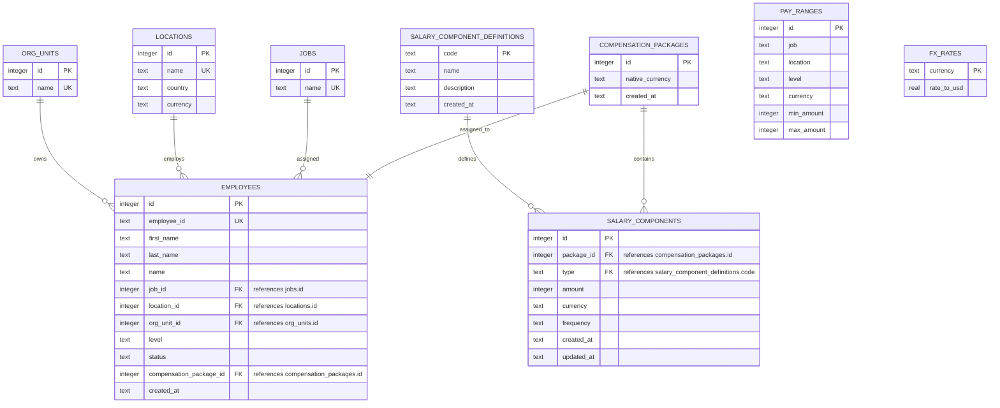

# Salary Management ERD

This diagram captures the current static salary-management schema used by the API.
The model is optimized around employee reads: employee rows hold the direct foreign keys for job, location, org unit, and current compensation package, while compensation details stay in package/component tables.

## Notes

- `employees.employee_id` is the stable business identifier exposed by the API.
- `employees.job_id` references the normalized `jobs` table.
- `employees.location_id` references the normalized `locations` table.
- `employees.org_unit_id` references the normalized `org_units` table.
- Each employee has one current `compensation_packages` row through `employees.compensation_package_id`.
- Each package has many `salary_components`.
- `salary_components.type` references `salary_component_definitions.code`, so component types can be defined at runtime.
- Money is stored as integer minor units in each row's native `currency`.
- `pay_ranges` are keyed by job, location, and level in the database.
- `fx_rates` support analytics normalization to USD without mutating stored native compensation.

## Design Explanation

The employee is the main access point for the application, so the employee row stores direct references to its lookup context: job, location, org unit, and current compensation package. This keeps common employee directory and employee detail reads straightforward: the API can load the employee and join outward to stable lookup tables.

Compensation is separated into a one-to-one package and one-to-many components. The package represents the employee's current compensation container, while `salary_components` stores individual line items such as base salary, allowance, bonus, or any future runtime-defined component.

Component types are intentionally data-driven through `salary_component_definitions`. This avoids schema changes whenever HR wants to add a new salary component type such as commission, retention grant, or relocation allowance.

`locations`, `jobs`, and `org_units` are normalized because they are shared dimensions used for filtering, grouping, and salary-band logic. `pay_ranges` currently stores job/location/level as business dimension values so it can model salary bands without forcing a heavier band-management workflow yet.

Currency is stored on the rows where it is needed. Location carries the default local payroll currency, packages/components preserve native compensation currency, and `fx_rates` provides static conversion rates for analytics.

## Attribute Relationships

| From table | From attribute | To table | To attribute | Cardinality |
|---|---|---|---|---|
| `employees` | `compensation_package_id` | `compensation_packages` | `id` | one employee has one package |
| `employees` | `job_id` | `jobs` | `id` | one job has many employees |
| `employees` | `location_id` | `locations` | `id` | one location has many employees |
| `employees` | `org_unit_id` | `org_units` | `id` | one org unit has many employees |
| `salary_components` | `package_id` | `compensation_packages` | `id` | one package has many components |
| `salary_components` | `type` | `salary_component_definitions` | `code` | one definition can be used by many components |

## Logical Links

These fields are intentionally duplicated as business dimensions rather than foreign keys in the current SQLite schema:

| Table | Attributes | Related table | Purpose |
|---|---|---|---|
| `pay_ranges` | `job`, `location`, `level` | `jobs`, `locations`, `employees.level` | Matches an employee's role and location context to a compensation band. |
| `fx_rates` | `currency` | `locations.currency`, `compensation_packages.native_currency`, `salary_components.currency`, `pay_ranges.currency` | Converts native compensation to USD for analytics. |
