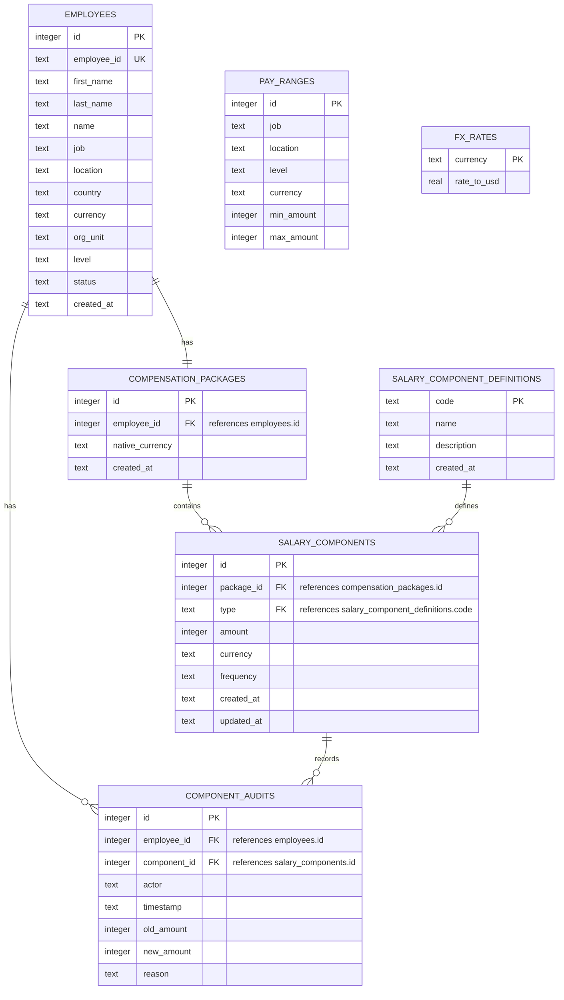

# Salary Management ERD

## Notes

- `employees.employee_id` is the stable business identifier exposed by the API.
- Each employee has one current `compensation_packages` row.
- Each package has many `salary_components`.
- `salary_components.type` references `salary_component_definitions.code`, so component types can be defined at runtime.
- Money is stored as integer minor units in each row's native `currency`.
- `component_audits` records amount changes for salary components.
- `pay_ranges` are keyed by job, location, and level in the database.
- `fx_rates` support analytics normalization to USD without mutating stored native compensation.

## Attribute Relationships

| From table | From attribute | To table | To attribute | Cardinality |
|---|---|---|---|---|
| `compensation_packages` | `employee_id` | `employees` | `id` | one employee has one package |
| `salary_components` | `package_id` | `compensation_packages` | `id` | one package has many components |
| `salary_components` | `type` | `salary_component_definitions` | `code` | one definition can be used by many components |
| `component_audits` | `employee_id` | `employees` | `id` | one employee has many audit rows |
| `component_audits` | `component_id` | `salary_components` | `id` | one component has many audit rows |

## Logical Links

These fields are intentionally duplicated as business dimensions rather than foreign keys in the current SQLite schema:

| Table | Attributes | Related table | Purpose |
|---|---|---|---|
| `pay_ranges` | `job`, `location`, `level` | `employees` | Matches an employee's role context to a compensation band. |
| `fx_rates` | `currency` | `employees.currency`, `compensation_packages.native_currency`, `salary_components.currency`, `pay_ranges.currency` | Converts native compensation to USD for analytics. |
