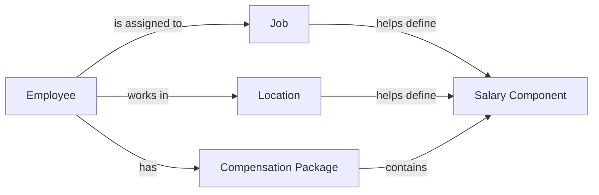
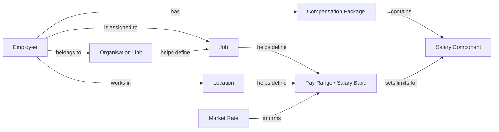
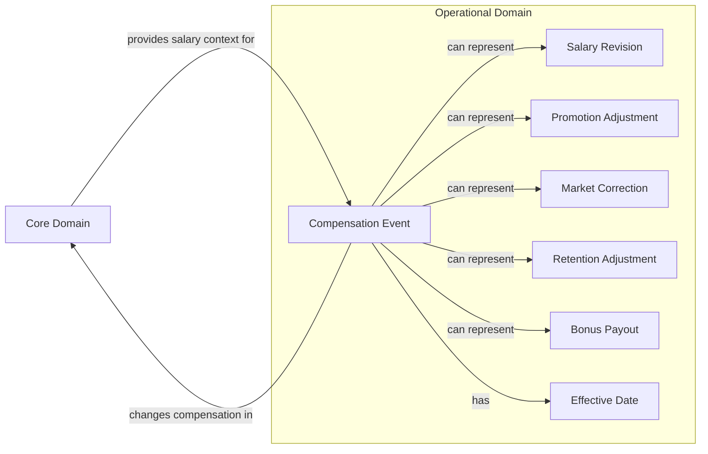
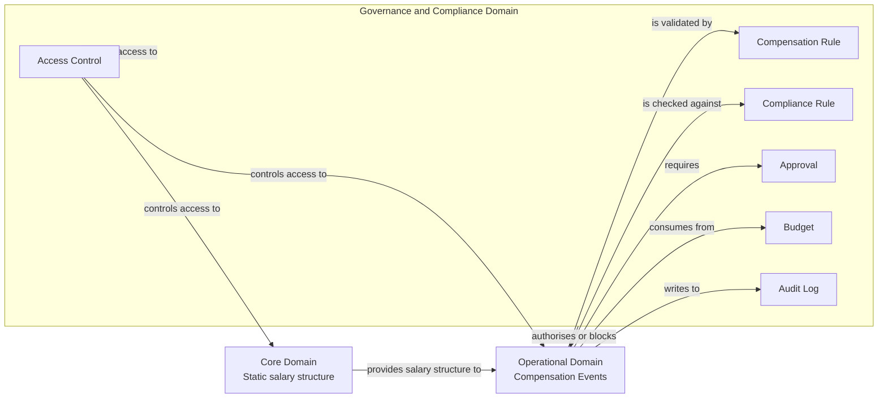
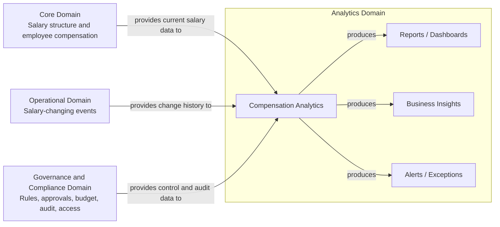
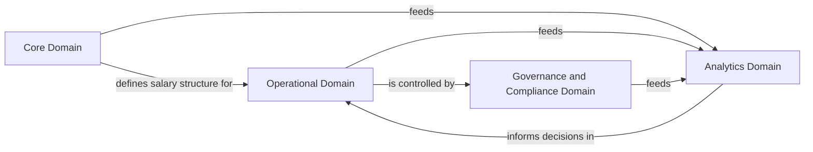

# Initial Research: HR Salary Management Domain

## 1. Purpose

The objective of this initial research is to understand the business domain of employee salary management before designing the software solution. 

At a high level, HR salary management covers the definition of compensation structures, assignment of salary packages, validation of salary decisions, compliance with organisational and legal rules, and governance of compensation changes.

## 2. HR Salary Management Functions

An initial review of HR salary management practices suggests that most business functions can be grouped around compensation design, employee salary assignment, salary revision, benchmarking, governance, and reporting.

The detailed function list is maintained separately here:

[HR_salary_functions](./HR_salary_functions)

For the purpose of this assessment, the salary management domain can be understood through a smaller set of core business entities. These entities form the foundation on top of which salary operations, approvals, validations, and analytics can be built.

## 3. Core Domain Entities

Most salary management functions revolve around the following core entities:

* Employee: The person whose compensation is being managed.
* Compensation Package: The complete pay structure assigned to an employee.
* Salary Component: The smallest individual part of a compensation package.
* Job: The business role used to determine how an employee should be compensated.
* Location: The geographic and payroll context that affects compensation.

These entities represent the basic static structure of the salary management domain. An employee is assigned to a job, works in a location, and has a compensation package. The compensation package is composed of salary components. The job and location influence how salary components are defined.

## 4. Extended Domain Entities

While the core entities are sufficient to represent basic salary structure, a real-world HR salary management system also requires additional business context.

The extended entities are:

* Organisation Unit: The business group responsible for the employee and their compensation cost.
* Pay Range / Salary Band: The expected compensation range for a job in a given context.
* Market Rate: The external benchmark used to compare compensation against the market.

## 5. Static Structure of the Domain

The entities above form the static structure of the salary management domain. These are relatively stable business concepts and are less likely to change frequently compared to salary transactions or approval workflows.

For example, employees, jobs, etc. define the base model of the system. They represent the “current state” of compensation and the business context needed to interpret it.

This static structure is important because most salary management operations depend on it. Salary revisions, promotions, new hire compensation and payroll changes all rely on these underlying entities.

## 6. Operational Layer: Compensation Changes

Once the static domain structure is established, the system must support operations that create or change compensation.

These operations should not directly mutate salary data without control. Instead, they should be represented as structured compensation actions or events that can be validated, reviewed, approved, and audited.

## 7. Governance and Compliance

Salary management is authority-sensitive because compensation data is confidential and salary changes directly affect company funds. Therefore, the system requires governance and compliance controls.

To support this, the domain should include:

* Compensation Rules: Verifications and validations that govern compensation decisions and movement of funds within the salary system.
* Approval Process: A controlled review mechanism that ensures salary changes are authorized before they become effective.

Compensation rules may include checks such as whether a salary component is valid for a location, whether the proposed compensation falls within the approved pay range, whether an increase exceeds permitted limits, or whether a change requires additional approval.

## 8. Analysis and Audit

In addition to managing salary structures and compensation changes, the system should support analysis and audit capabilities. These capabilities are important because salary management affects both business cost and employee trust.

### Analysis

The analysis layer helps HR and leadership understand the health of compensation across the organisation. It uses existing salary data, job data, location data, pay ranges, market rates, and compensation changes to generate business insights.

### Audit

The audit layer ensures that all salary-related actions are traceable. Since compensation data is sensitive and salary changes directly affect company funds, every important action should be recorded.

Auditability is important for compliance, internal control, dispute resolution, and accountability. It also helps prevent unauthorized or unexplained salary changes.

Together, analysis and audit ensure that the system is not only operationally useful, but also transparent, explainable, and trustworthy.

## 9. Emerging Domain Model

Based on this initial research, the salary management system can be divided into four conceptual layers:

Static Domain Layer: This layer defines the core business structure.
Operational Layer: This layer represents compensation-related actions.
Governance Layer: This layer controls whether compensation changes are valid and authorized.
Analysis and Audit Layer :This layer provides visibility, traceability, and business insight.

## 10. Conclusion

The Salary domain can be divided into a core domain that defines the unchanging ground, the rest can change depending upon their internal structure without hindering the core data.

For our purposes we can implement the inital part of the core domain with some parts of the analytics to comply with the problem statement
