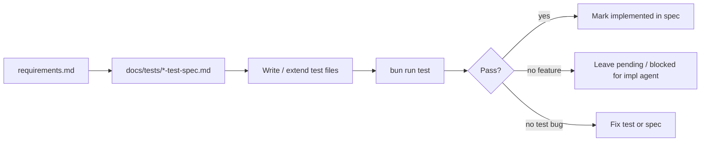

# Testing Agent Specification

This document defines how a **testing agent** works in the Incubyte repo: what it reads, what it produces, and how it coordinates with implementation agents.

## Mission

Turn `docs/requirements.md` into executable, deterministic tests **before or alongside** feature work. The testing agent owns test design and test files; it does not change product behavior unless explicitly asked to implement missing code.

Primary outputs:

1. Test specifications under `docs/tests/` (human- and agent-readable contracts).
2. Executable tests in `api/src/**/*.test.ts`, `api/src/domain/**/*.test.ts`, and later `web/src/**/*.test.tsx`.
3. Updated coverage status in the relevant test spec (implemented / pending / skipped).

## Document hierarchy for testers

| Priority | Document | Use |
|---|---|---|
| 1 | `docs/requirements.md` | FR/NFR IDs and acceptance assertions |
| 2 | `docs/tests/api-test-spec.md` | API test case catalog (this repo's first test spec) |
| 3 | `docs/spec.md` | Routes, response shapes, seed rules |
| 4 | `docs/scope.md` | Do not test out-of-scope behavior (audit, RBAC, etc.) |
| 5 | `docs/erd.md` | Schema and FK expectations for schema tests |

Implementation agents read `AGENTS.md`. Testing agents read this file plus the test specs.

## Test layers

| Layer | Location | Runner | DB / network | Maps to |
|---|---|---|---|---|
| `unit` | `api/src/domain/*.test.ts` | `bun test` | None | FR-3, FR-7–FR-11 math, NFR-2 |
| `api` | `api/src/*.test.ts` | `bun test` | In-memory SQLite | FR-1–FR-6, FR-7–FR-11 HTTP, FR-12 |
| `schema` | `api/src/db.test.ts` | `bun test` | In-memory SQLite | FR-13, NFR-1 indexes |
| `web` | `web/src/**/*.test.tsx` | `vitest` | jsdom; mock fetch | UI (future spec) |

Run from repo root:

```bash
bun run test          # all workspaces
cd api && bun test    # api only
```

## Conventions

### Harness (API)

- Call `handleRequest(request, db)` from `api/src/server.ts` — do not bind a port in tests.
- Fresh DB per test: `openDatabase(":memory:")`.
- Seed via `seedDatabase(db, { count: N })` for integration scenarios; use hand-built inserts for golden fixtures when exact amounts matter.
- HTTP helpers: `jsonRequest(url, method, body)` pattern from `server.test.ts`.
- Test names include the spec case ID: `` `FR-1 API-EMP-LIST-003 clamps pageSize to 100` ``.

### Determinism (NFR-3)

- No `Date.now()` assertions unless frozen/mocked.
- No network calls.
- Faker only through `seedDatabase` with fixed seed `20260701`.
- Large-count tests (10k) may live in a separate `describe` and stay optional in local dev if slow; mark them in the spec.

### Money

- Assert integer minor units in API JSON.
- Golden fixture for FR-3 annualization (EUR package): base `12000000` annual + allowance `100000` monthly + bonus `1200000` one_time → `annualizedTotal` `14400000` (144000 EUR in major units notation from requirements).

### Status markers in test specs

Each case row has a **Status** column:

| Status | Meaning |
|---|---|
| `implemented` | Test exists and passes |
| `pending` | Spec written; test not yet added or feature missing |
| `blocked` | Waiting on unimplemented route or domain module |
| `skipped` | Out of scope or intentionally deferred |

Update status when adding or landing tests.

## Workflow



### Standard task sequence

1. Read the FR/NFR row in `docs/requirements.md`.
2. Find or add cases in `docs/tests/api-test-spec.md`.
3. Implement tests in the correct layer (`unit` vs `api` vs `schema`).
4. Run `cd api && bun test` (or root `bun run test`).
5. Set case status to `implemented` only when green.
6. If the feature is missing, commit **failing tests** only when the team wants TDD; otherwise leave cases `pending` until the route exists.

### Division of labor

| Testing agent | Implementation agent |
|---|---|
| Adds test spec cases | Adds route/domain code |
| Writes `*.test.ts` | Writes `server.ts`, `domain/`, `db.ts` |
| Updates spec status | Updates `docs/spec.md` implementation status |
| Flags spec/req conflicts | Resolves behavior per `scope.md` |

## Coverage gates (API MVP)

Before marking the API done in `docs/spec.md`:

- Every `implemented` row in `docs/tests/api-test-spec.md` for FR-1–FR-6 and FR-12–FR-13 passes.
- FR-7–FR-11 cases move from `blocked` → `implemented` when analytics ships.
- `bun run lint` clean in `api/`.
- No skipped cases without a note in the spec.

## File layout

```text
docs/
  testing-agent.md          # this file
  tests/
    README.md               # index of test specs
    api-test-spec.md        # API test catalog
api/src/
  server.test.ts            # HTTP integration tests
  db.test.ts                # schema + index tests (planned)
  seed.test.ts              # seed determinism (planned)
  domain/
    *.test.ts               # pure domain tests (planned)
```

Future: `docs/tests/web-test-spec.md`, `docs/tests/domain-test-spec.md`.

## Anti-patterns

- Do not test audit logs, auth, or CSV — out of scope.
- Do not start a real `Bun.serve` listener in unit/api tests.
- Do not use production `api/data/dev.sqlite` in tests.
- Do not assert floating-point money.
- Do not weaken assertions to make tests pass; fix code or update requirements through `scope.md`.

## Pull request checklist (testing agent)

- [ ] New/changed behavior has cases in `docs/tests/api-test-spec.md`
- [ ] Test names reference case IDs where applicable
- [ ] `bun run test` passes (or failing cases clearly marked `pending`/`blocked`)
- [ ] Spec status column updated
- [ ] No out-of-scope tests added
